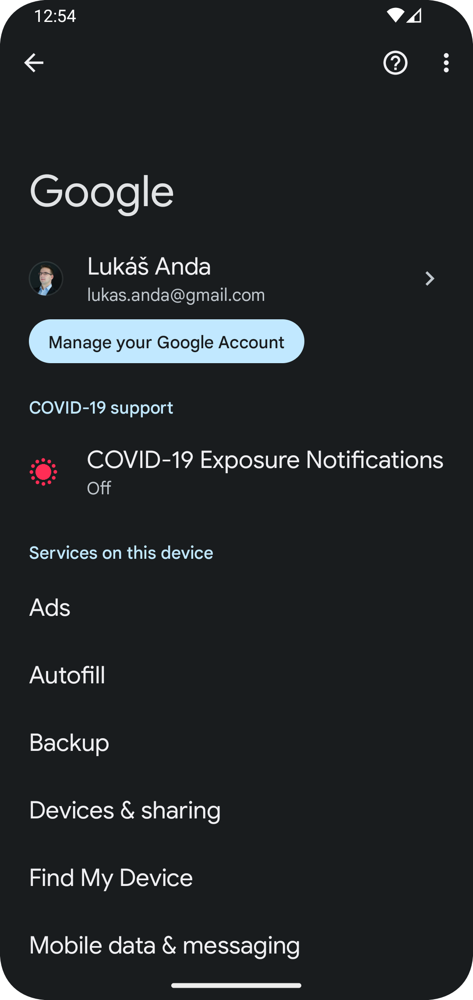
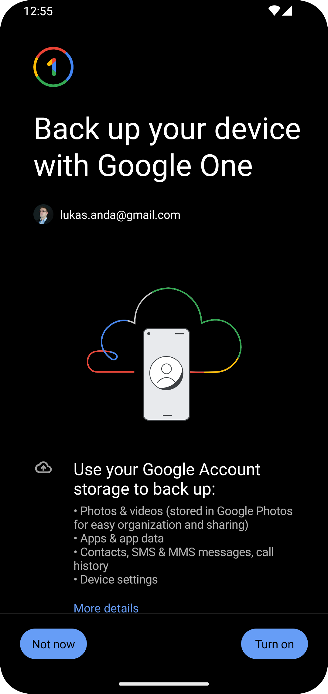
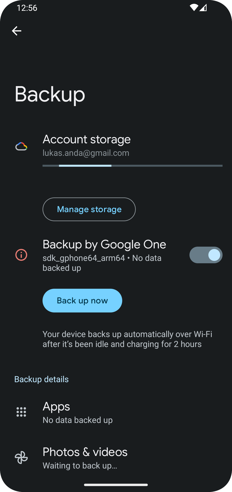

# Block Store Android Sample

Welcome to the sample Android project showcasing the power of Block Store app integration!

🚀 This repository provides a hands-on demonstration of utilizing Block Store in your Android applications while leveraging the power of coroutines and Jetpack Compose.

🔐[Block Store](https://developers.google.com/identity/blockstore/android) is a secure and efficient solution provided by Google Identity to manage cryptographic keys in Android apps. With this project, you'll learn how to seamlessly integrate Block Store into your Android projects while harnessing the benefits of coroutines for asynchronous programming and Jetpack Compose for creating beautiful and responsive user interfaces.

## Requirements
- Android Studio
- Emulator or a physical device with backup and screen lock enabled (screen lock is optional)

## Check if backing up is enabled
| Step                                                      | Screenshot                                                                                        |
|-----------------------------------------------------------|---------------------------------------------------------------------------------------------------|
| Go to **Settings** -> **Google**                          |     |
| Select **Backup** option                                  |                    |
| This is how it looks like when backup is set up correctly |  |

## Testing
The repository includes two instrumentation tests that cover setting and observing values and testing behavior across app restarts. To run the tests, you can click on the green arrow at the BlockStorageTest class in Android Studio or execute the following command in the project root:

    ./gradlew connectedAndroidTest
This test case covers testing setting and observing the values and testing the behavior across app restarts. Unfortunately, Espresso does not allow us to reinstall the app, therefore it is not possible to test this usecase with just Espresso.
## How it works
The app incorporates a class called BlockStoreHelper to facilitate interactions with Block Store. This helper class exposes a set of simple functions that enable storing, restoring, and deleting values from Block Store. To achieve a more streamlined programming experience, the helper class utilizes coroutines instead of callbacks.

Here's an example of the extension function used in the `BlockStoreHelper` class to convert task to coroutines:

	private suspend fun <T> Task<T>.await(): T = suspendCoroutine { continuation ->  
		addOnCompleteListener { task ->  
			if (task.isSuccessful) {  
				continuation.resume(task.result)  
			} else {
				continuation.resumeWithException(  
					task.exception ?: RuntimeException("Unknown task exception")  
				)  
			}  
		}  
	}

Then the helper exposes a set of simple function that allow storing, restoring and deleting the values from Block Store. It is important to remember that the current limit is 16 values (stored as a byte arrays) stored with unique keys.

## Notes and limitations
-  End to End Encryption
    -   End to End encryption is supported on devices running Android 9 (API 29) and above.
    - The device must have a screen lock set with a PIN, pattern, or password for end to end encryption to be enabled and correctly encrypt the user’s data.
    - In the helper class, you can disable checking for encryption by setting `requireE2EEncryption` to `false`
- Device to Device Restore Flow
    - **Source** devices must be running Android 6 (API 23) and above to backup.
    - **Target** devices running Android 9 (API 29) and above to have the ability to restore.
- Cloud Backup and Restore Flow
    - **Source** devices must be running Android 6 (API 23) and above to backup.
    - **Target** devices are supported based on their vendors. Pixel devices can use this feature from Android 9 (API 29) and all other devices must be running Android 12 (API 31) or above.